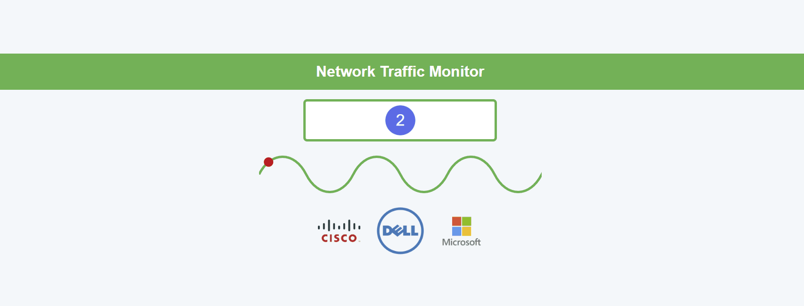

# Packet Anomaly Detection using Random Forest

## Introduction

In this script, we perform anomaly detection on network packet data using a machine learning approach. The goal is to predict whether network traffic belongs to a normal or anomalous class based on features such as packet time and length.

The process includes:

1. **Data Loading and Preprocessing**: We load the dataset and perform basic data analysis, including checking the statistical summary and visualizing key features.
2. **Feature Engineering**: We encode categorical variables and scale numerical features to prepare the data for training the machine learning model.
3. **Model Training**: We use a Random Forest Classifier, a powerful ensemble learning method, to train the model on the data.
4. **Model Evaluation**: After training the model, we evaluate its performance using metrics such as accuracy, precision, recall, and F1-score.
5. **Visualization**: We visualize the packet data, the distribution of target classes, and model performance through various plots.

In addition to the anomaly detection script, we also developed a **Flask web application** to monitor and detect anomalies in real-time network traffic. The Flask app provides:

### Flask Web Application:
- **Real-time Anomaly Detection**: The app runs a background process that monitors a CSV file containing packet data. It checks for new packets every 10 seconds and predicts whether each packet is normal or anomalous based on the trained Random Forest model.
- **Alerts and Notifications**: If any anomalies are detected, they are added to an alert list. This list is accessible via the Flask app.
- **Endpoints**:
  - `/alerts`: A REST endpoint that returns the list of detected anomalies in JSON format.
  - `/normal_traffic`: A REST endpoint that returns only the normal traffic (i.e., packets predicted as "Normal") in JSON format.
  - `/`: The main homepage of the Flask app that displays a list of alerts, giving real-time feedback on anomalies in the packet traffic.

The Flask application continuously checks for new data, applies the anomaly detection model to the incoming data, and provides a dynamic and interactive web interface to visualize detected anomalies and monitor network traffic in real-time.

This script leverages libraries like `pandas` for data manipulation, `scikit-learn` for machine learning, and `matplotlib` for visualization.

---